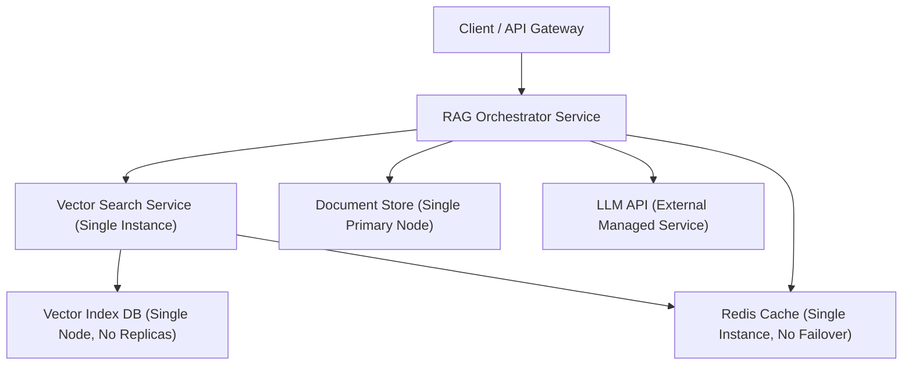

```mermaid
flowchart TD

    A["Client / API Gateway"] --> B["RAG Orchestrator Service"]

    B --> C["Vector Search Service (Single Instance)"]
    C --> D["Vector Index DB (Single Node, No Replicas)"]

    B --> E["Document Store (Single Primary Node)"]
    B --> F["LLM API (External Managed Service)"]

    B --> G["Redis Cache (Single Instance, No Failover)"]
    C --> G
```
